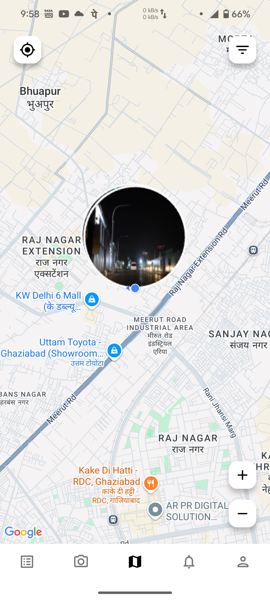

# Nivaran - Civic Issue Reporting & Management App

Nivaran is a Flutter-based mobile application designed to bridge the gap between citizens and local authorities by providing a platform for reporting, tracking, and resolving civic issues.

## Overview

Nivaran empowers citizens to report various local problems such as potholes, garbage dumping, street light outages, and more, directly from their mobile devices. These reports, enriched with details, images, and geo-location, are then accessible to concerned officials for timely acknowledgement and resolution. The app aims to foster transparency and efficiency in addressing public grievances.

## Features

1.  **Secure User Authentication**: Multi-factor authentication with biometric support ensures robust security for user accounts. Users can sign up via email, social media, or phone verification, with automatic session management and secure password recovery options.

2.  **AI-Powered Issue Categorization**: Leveraging advanced machine learning algorithms, the app automatically categorizes reported issues into predefined categories like infrastructure, sanitation, or public safety. This feature includes smart suggestions for issue resolution based on historical data and similar cases.

3.  **Real-Time Collaboration Platform**: Citizens and officials can collaborate seamlessly on issue resolution through integrated live chat, document sharing, and progress tracking. This fosters transparent communication and accelerates problem-solving processes.

4.  **Predictive Maintenance Alerts**: Using AI-driven analytics, the app predicts potential civic issues before they escalate. Based on patterns in reported data, users receive proactive alerts about areas prone to problems, enabling preventive measures.

5.  **Offline Reporting Capability**: Full offline functionality allows users to capture and store issue reports without internet connectivity. Reports are automatically synchronized when connectivity is restored, ensuring no data loss in remote or low-signal areas.

6.  **Integrated Map Visualization**: Interactive maps with customizable heatmaps display issue density, resolution status, and geographic trends. Users can zoom, filter, and overlay data layers for comprehensive spatial analysis of civic challenges.

7.  **Community Impact Tracking**: Detailed dashboards provide analytics on community engagement, issue resolution rates, and overall impact. Citizens can view their contribution to local improvements, while officials track performance metrics and resource allocation.

8.  **Multi-Language Support**: Comprehensive localization supports multiple languages, making the app accessible to diverse user groups. Voice commands, text input, and notifications are available in regional languages, promoting inclusivity and wider adoption.

## 📸 App Screenshots

Here’s an overview of the **Nivaran** app’s key screens and features:

| | | | |
| :---: | :---: | :---: | :---: |
|  |  |  |  |
|  |  |  |  |
|  |  |  |  |
|  |  |  |  |

### Detailed Screen Descriptions

1.  **Splash Screen**: The initial loading screen displayed when the app launches, featuring the Nivaran logo prominently centered on a clean background. It likely includes a progress indicator or animation while the app initializes authentication, loads local data, and prepares the main interface. This screen sets the app's branding tone with a professional, civic-focused design.

2.  **Public Dashboard**: The main home screen for public users, displaying a feed of reported civic issues in the local area. It shows issue cards with titles, categories (e.g., infrastructure, sanitation), status indicators (pending, in progress, resolved), and thumbnails of attached images. Includes navigation tabs for different views (all issues, nearby, trending) and a floating action button for quick reporting.

3.  **Officials Issue Dashboard**: A comprehensive dashboard for government officials, showing all reported issues filtered by jurisdiction or department. Displays issue statistics, priority levels, and assignment status. Features include bulk actions for updating multiple issues, filtering by category or location, and quick access to detailed issue views for resolution tracking.

4.  **Officials Statistics 1**: The first part of an analytics dashboard for officials, presenting key performance metrics through interactive charts and graphs. Likely includes bar charts showing issue resolution rates by category, pie charts for issue distribution, and line graphs tracking resolution times over periods. Uses the fl_chart package for visualization.

5.  **Officials Statistics 2**: Continuation of the statistics dashboard, focusing on deeper analytics such as geographic heatmaps of issue density, trend analysis for recurring problems, and resource allocation metrics. May include comparative data between different time periods or regions, helping officials identify patterns and optimize response strategies.

6.  **Officials Alerts**: A notification center for officials displaying urgent alerts about high-priority issues, system updates, or escalated complaints. Shows alert types (emergency, deadline approaching, public safety), timestamps, and direct links to affected issues. Includes filtering options and mark-as-read functionality for efficient alert management.

7.  **Officials Profile 1**: The first section of an official's profile screen, displaying personal information, department affiliation, and contact details. Includes profile photo, name, role (e.g., municipal engineer), and jurisdiction area. May show basic statistics like issues handled and resolution rate.

8.  **Officials Profile 2**: The second section of the official's profile, focusing on professional details and settings. Likely includes work history, specializations, notification preferences, and account security options. May also show recent activity or achievements in issue resolution.

9.  **User Issue Dashboard**: A personalized dashboard for regular users showing their reported issues. Displays issue status, submission dates, and progress updates. Includes options to edit pending reports, view resolution details, and track the impact of their contributions to community improvements.

10. **AI Prediction**: A screen showcasing AI-driven insights and predictions based on reported data patterns. Displays predictive alerts for potential future issues in specific areas, risk assessments for infrastructure problems, and suggested preventive measures. Uses machine learning algorithms to analyze historical data and provide proactive recommendations.

11. **User Captures Image**: The camera interface for users to capture photos when reporting issues. Features a full-screen camera view with controls for flash, zoom, and image quality. Includes real-time preview, capture button, and options to retake or proceed to the next step in the reporting process.

12. **Report an Issue**: The main form screen for submitting new civic issue reports. Contains fields for issue title, detailed description, category selection (dropdown), location (auto-detected or manual), and image attachment. Includes validation for required fields and a submit button that triggers offline sync if needed.

13. **Voice Reporting on Issue**: An alternative input method allowing users to report issues via voice recording. Features a microphone button for recording, real-time audio waveform visualization, and speech-to-text conversion. Supports multiple languages for accessibility and includes playback options for review before submission.

14. **Map View**: An interactive map screen displaying reported issues as markers across the user's location. Uses Google Maps integration to show issue density, with color-coded markers indicating status (red for urgent, yellow for in progress, green for resolved). Includes search functionality and filtering by category or date range.

15. **Map Zoom & Marker**: A detailed view of the map with enhanced zoom capabilities and individual issue markers. When a marker is tapped, it shows a popup with issue summary, photo thumbnail, and quick actions. Supports multi-touch gestures for zooming and panning, with options to view issue details or navigate to the location.

16. **User Alerts**: A notifications screen for regular users displaying updates on their reported issues, system announcements, and community alerts. Shows alert types (issue update, resolution complete, new feature), timestamps, and direct links to relevant screens. Includes swipe-to-dismiss and mark-all-as-read functionality.

17. **User Profile**: The user's personal profile screen showing account information, reporting history, and app preferences. Displays profile photo, name, contact details, and statistics like total issues reported and resolution success rate. Includes settings for notifications, language, and account management options.

18. **Comments**: A discussion screen for collaborative issue resolution, showing threaded comments between users and officials. Displays user avatars, timestamps, and comment content with support for text, images, and attachments. Includes options to reply, like comments, and moderate content for maintaining constructive dialogue.

## Tech Stack

* **Frontend:** Flutter
* **Backend & Database:** Firebase
    * **Authentication:** Firebase Auth (Email/Password, Google,)
    * **Database:** Cloud Firestore (for storing user data, issues, comments, etc.)
    * **Storage:** Firebase Storage (for image uploads)
    * **Push Notifications:** Firebase Cloud Messaging (FCM)
* **State Management:** Provider
* **Mapping:** Google Maps Flutter
* **Location:** Geolocator, Geocoding
* **Image Handling:** Image Picker, Camera, Photo View, Image Cropper
* **HTTP Client:** `http` package
* **Local Notifications:** `flutter_local_notifications`
* **Charting:** `fl_chart` (for official statistics)

## Project Structure

The project follows a standard Flutter project structure with detailed focus on the lib/ directory:
